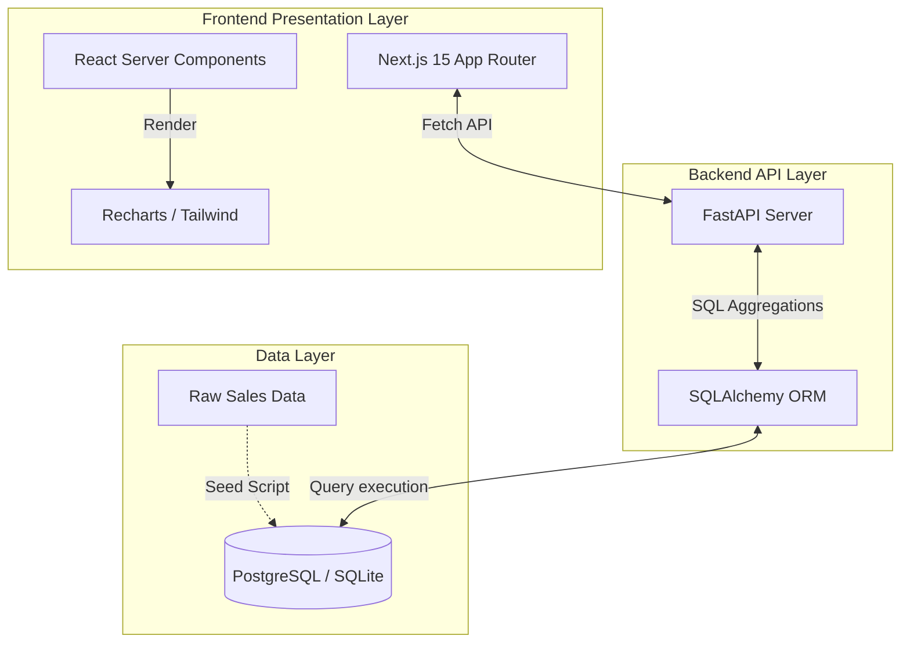

# RetailOps Analytics Platform


A full-stack, enterprise-grade retail analytics platform built to process and visualize large-scale transaction data. This project demonstrates end-to-end data engineering, API development, and modern UI/UX design, specifically optimized for high-performance Business Intelligence.

---

## Executive Summary

Most data analytics projects rely on static notebooks or unoptimized direct database querying. RetailOps Analytics was engineered to solve the "O(N) memory leak" problem common in junior data applications. By pushing all heavy aggregation (SUM, COUNT, GROUP BY) down to the PostgreSQL/SQLite engine via SQLAlchemy, this application can securely aggregate thousands of transaction records in milliseconds, streaming the processed KPIs via a FastAPI backend to a server-side rendered React dashboard.

## Core Data Analytics Skills Demonstrated

### 1. Advanced SQL & Data Aggregation
The primary engineering feat of this project is the strictly optimized SQL data layer. Instead of pulling raw data into memory, all computations are executed within the database engine using SQLAlchemy (Python's premier SQL toolkit).
- Computes Total Revenue, Profit Margins, and Average Order Value dynamically using native SQL `SUM()`, `COUNT()`, and `GROUP BY` functions.
- Implements complex SQL projections (e.g., `SUM(weekly_sales * 0.18)`) to derive implicit metrics not native to the raw dataset.

### 2. Python Data Engineering
- **FastAPI & Python 3.10+:** Engineered a high-performance REST API to serve the aggregated data. 
- **Pydantic:** Validates data contracts to ensure absolute data integrity before it reaches the presentation layer.

### 3. Custom Business Intelligence (Replacing Tableau/PowerBI)
While traditional Data Analysts rely on locked-in vendor tools like **Tableau** or **PowerBI**, this project demonstrates the ability to build a **fully custom, full-stack BI Dashboard from scratch**.
- Built with Next.js 15 App Router using React Server Components (RSC) to guarantee zero client-side data fetching overhead.
- Utilizes Recharts for dynamic, interactive data visualization (Area charts, Pie charts) that match the exact capabilities of enterprise BI software but with complete layout control.

### 4. Customer Cohort Analysis
Includes a dynamic customer segmentation endpoint that categorizes users based on purchasing behavior (Champions, Loyal, At-Risk, Lost) providing actionable business value rather than just vanity metrics.

## How It Works Under The Hood (Technical Breakdown)

If you are reviewing this architecture, here is the exact data flow from the database to the screen:

### 1. The Database Layer (PostgreSQL/SQLite)
The foundation of the project is the `Sale` table, which holds thousands of rows of transaction data (Store ID, Weekly Sales, Product Category, etc.). 
- Instead of pulling all this raw data into Python (which would cause a memory leak on large datasets), the database does the heavy lifting.
- When a request is made, the database executes SQL commands to sum up the revenue and count the orders *before* sending anything back.

### 2. The Backend API (FastAPI & SQLAlchemy)
The Python backend acts as the middleman.
- **SQLAlchemy** is used to write Python code that translates into the optimized SQL queries mentioned above. For example, `func.sum(Sale.weekly_sales)` tells the database to add up all the sales.
- **FastAPI** takes the results from the database, wraps them in a secure JSON format using **Pydantic** (to ensure the data types are strictly correct), and creates an API endpoint (e.g., `http://127.0.0.1:8000/api/v1/dashboard/kpis`).

### 3. The Frontend (Next.js & React)
The user interface is built with Next.js 15, utilizing modern React Server Components (RSC).
- **Server-Side Fetching:** The Next.js server calls the FastAPI endpoints. It securely fetches the aggregated KPI data on the server.
- **Hydration & Display:** The data is passed to UI components (like the `Recharts` graphs or `shadcn/ui` cards). The final, beautiful HTML is sent to the user's browser, resulting in a lightning-fast dashboard that requires zero loading spinners for the initial data fetch.

---

## System Architecture Diagram



---

## Technical Stack

### Data Engineering & Backend
- **Framework:** FastAPI
- **Language:** Python 3.10+
- **ORM:** SQLAlchemy (for advanced SQL query generation)
- **Database:** SQLite (Development) / PostgreSQL (Production)
- **Data Source:** Synthetically generated 5,000+ row dataset based on the [Walmart Store Sales Forecasting Dataset on Kaggle](https://www.kaggle.com/c/walmart-recruiting-store-sales-forecasting/data).

### Frontend
- **Framework:** Next.js 15 (React 19)
- **Language:** TypeScript (Strict Mode)
- **Styling:** Tailwind CSS v4
- **Visualization:** Recharts

---

## Local Development Setup

To run this project locally, you must start both the backend API server and the frontend Next.js server.

### 1. Backend (FastAPI)

Navigate to the backend directory and set up a virtual environment:

```bash
cd backend
python -m venv venv

# Activate the virtual environment
# On Windows:
.\venv\Scripts\Activate.ps1
# On macOS/Linux:
source venv/bin/activate

# Install dependencies
pip install -r requirements.txt

# Run the API server
uvicorn main:app --reload --host 127.0.0.1 --port 8000
```
The interactive Swagger API documentation will be available at `http://127.0.0.1:8000/docs`.

### 2. Frontend (Next.js)

Open a new terminal window, navigate to the frontend directory, and install dependencies:

```bash
cd frontend

# Install Node modules
npm install

# Start the development server
npm run dev
```
The web application will be available at `http://localhost:3000`.

---

## Future Enhancements
- **Machine Learning Integration:** Implement a predictive forecasting model (XGBoost/ARIMA) utilizing the existing dataset's temporal, holiday, and macroeconomic features (CPI, Fuel Price).
- **Automated Data Pipelines:** Integrate Airflow or dbt to handle nightly batch transformations instead of relying on real-time API aggregations.

## License
This project is open-source and available under the MIT License.
