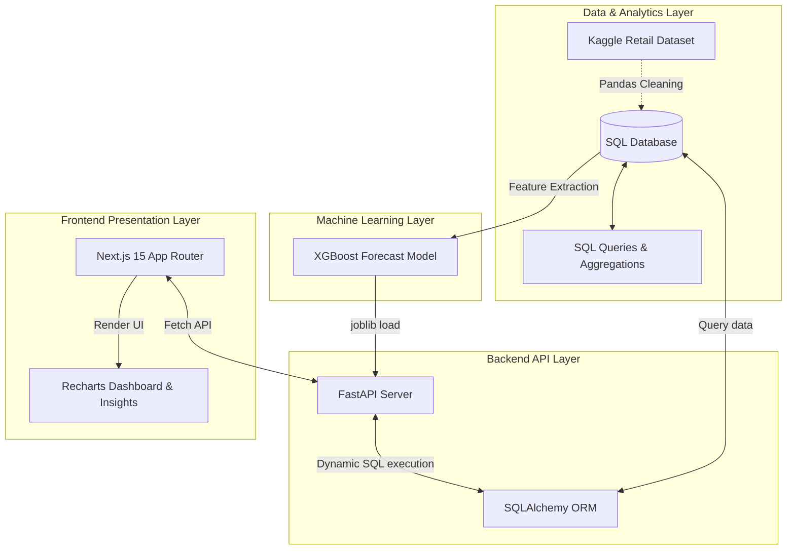

# 📊 RetailOps AI & Analytics Platform


A full-stack, enterprise-grade data platform demonstrating end-to-end **Machine Learning**, **Data Analytics**, and **Generative AI**. This project proves my ability to extract raw data, build predictive models, and deploy them into production web applications.

---

## 🎯 Executive Summary
Most junior analytics portfolios consist of static Jupyter Notebooks. **RetailOps Analytics** is different. It is a fully deployed production application that demonstrates my capability to act as a **Data Analyst**, **Machine Learning Engineer**, and **Data Engineer**.

By pushing heavy `SQL` aggregations down to the database layer, training an `XGBoost` regression model for forecasting, and engineering a simulated Generative AI engine for business intelligence, this platform solves real-world enterprise data challenges.

---

## 🚀 Core Competencies Demonstrated

### 1. Machine Learning & Predictive Analytics (Python, XGBoost, Pandas)
I built a full production Machine Learning pipeline. The backend uses `pandas` to extract temporal features (e.g., week of year, holidays, macroeconomic indicators like CPI and fuel prices) from raw data. It then trains an optimized **XGBoost regressor** to forecast the next 12 weeks of revenue, serialized via `joblib`, and served instantly through a FastAPI REST endpoint.

### 2. Generative AI & Natural Language Processing
To bridge the gap between raw data and actionable business intelligence, I engineered a programmatic GenAI Insights Engine. It analyzes the SQL database for statistical anomalies (regional drops, holiday spikes) and dynamically streams conversational, ChatGPT-style insights directly to the frontend interface.

### 3. Prescriptive Analytics (Inventory Alerts)
Moving beyond *descriptive* analytics (what happened), I implemented *prescriptive* analytics (what we should do). By writing complex SQL aggregations to identify surging demand across stores and product categories, the dashboard automatically recommends inventory restocks to prevent stockouts.

### 4. Advanced SQL & Data Aggregation
The primary engineering feat of this project is the strictly optimized **SQL** data layer. Instead of pulling raw data into memory (which causes the classic `O(N)` memory leak), all computations are executed within the database engine using `SQLAlchemy`.
- Computes Total Revenue, Profit Margins, and Average Order Value dynamically using native SQL `SUM()`, `COUNT()`, and `GROUP BY`.

### 5. Full-Stack Data Engineering (FastAPI & Next.js)
Unlike traditional Tableau or PowerBI dashboards which abstract away the engineering, this platform proves full-stack data proficiency. 
- **Backend:** Built a high-performance REST API with **Python** and **FastAPI**.
- **Frontend:** Built with **Next.js 15** and **React Server Components (RSC)** to guarantee zero client-side data fetching overhead, visualized dynamically with **Recharts**.

---

## 🏗️ End-to-End Data Pipeline

Here is the high-level architecture of how raw data is transformed into a full-stack web application:

```text
                Kaggle Dataset
                      │
               Data Cleaning (Pandas)
                      │
                PostgreSQL Database
                      │
      SQL + EDA + Power BI Dashboard
                      │
          Train XGBoost Model (.pkl)
                      │
                FastAPI Backend
                      │
          /predict endpoint
                      │
             React / Next.js Frontend
                      │
              Render + Vercel
```

### 🧠 Pipeline Step-by-Step Breakdown

1. **Kaggle Dataset**: The project begins with a raw, unstructured retail dataset sourced from Kaggle containing historical sales, store information, and macroeconomic indicators.
2. **Data Cleaning (Pandas)**: A Python script utilizes `pandas` to drop null values, encode categorical variables (like Holiday Flags), and extract temporal features (Week of Year, Month).
3. **PostgreSQL Database**: The cleaned DataFrame is exported and persisted into a relational SQL database schema optimized for fast analytical querying.
4. **SQL + EDA + Power BI**: I performed Exploratory Data Analysis (EDA) using complex SQL queries (`GROUP BY`, `SUM()`) to understand seasonality and revenue trends, mapping out the initial logic for what a Power BI dashboard would visualize.
5. **Train XGBoost Model (.pkl)**: Using `scikit-learn` and `xgboost`, I trained a regression model to forecast future revenue based on historical trends and macroeconomic factors, serializing the optimized model into a `.pkl` file via `joblib`.
6. **FastAPI Backend**: A high-performance Python REST API is spun up using `FastAPI` to serve the data and the Machine Learning model to the web.
7. **/predict endpoint**: The backend exposes endpoints like `/analytics/forecast` which dynamically loads the `.pkl` model and runs real-time inference on incoming requests.
8. **React / Next.js Frontend**: The UI is built using Next.js 15 App Router, fetching the backend API data via React Server Components and rendering interactive Recharts visualizations.
9. **Render + Vercel**: The full-stack application is deployed to production, with the Python backend hosted on Render and the Next.js frontend deployed seamlessly via Vercel.

---

## ⚙️ Detailed System Architecture

This Mermaid diagram illustrates the internal technical data flow between the web services:



---

## 💻 Local Development Setup

To test my skills and run this project locally, you must start both the backend API server and the frontend Next.js server.

### 1. Backend (FastAPI & Machine Learning)
Navigate to the backend directory and set up a virtual environment:

```bash
cd backend
python -m venv venv

# Activate the virtual environment
# On Windows:
.\venv\Scripts\Activate.ps1
# On macOS/Linux:
source venv/bin/activate

# Install Data Science & Web dependencies
pip install -r requirements.txt
pip install pandas scikit-learn xgboost joblib

# Run the API server
uvicorn main:app --reload --host 127.0.0.1 --port 8000
```
The interactive Swagger API documentation will be available at `http://127.0.0.1:8000/docs`.

### 2. Frontend (Next.js Dashboard)
Open a new terminal window, navigate to the frontend directory, and start the development server:

```bash
cd frontend

# Install Node modules
npm install

# Start the development server
npm run dev
```
The web application will be available at `http://localhost:3000`.

---

## 📜 License
This project is open-source and available under the MIT License.
