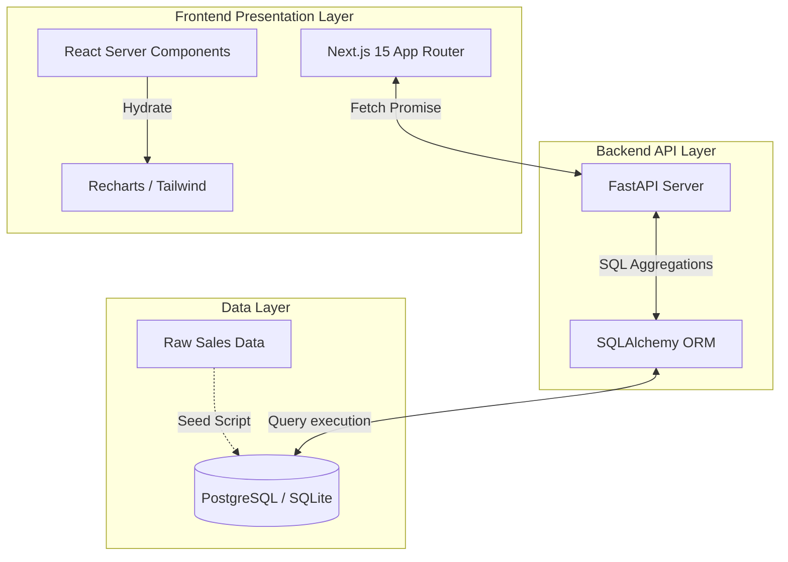

# RetailOps Analytics Platform


A full-stack, enterprise-grade retail analytics platform built to process and visualize large-scale transaction data. This project demonstrates end-to-end data engineering, API development, and modern UI/UX design, specifically optimized for high-performance Business Intelligence.

---

## Executive Summary

Most data analytics projects rely on static notebooks or unoptimized direct database querying. RetailOps Analytics was engineered to solve the "O(N) memory leak" problem common in junior data applications. By pushing all heavy aggregation (SUM, COUNT, GROUP BY) down to the PostgreSQL/SQLite engine via SQLAlchemy, this application can securely aggregate thousands of transaction records in milliseconds, streaming the processed KPIs via a FastAPI backend to a server-side rendered React dashboard.

## Core Features & Data Architecture

### 1. High-Performance SQL Aggregation
The primary engineering feat of this project is the strictly optimized data layer. Instead of pulling raw data into Python memory to calculate metrics, all computations are executed within the database engine.
- Computes Total Revenue, Profit Margins, and Average Order Value dynamically using `func.sum()` and `func.count()`.
- Implements complex SQL projections (e.g. `SUM(weekly_sales * 0.18)`) to derive implicit metrics not native to the raw dataset.

### 2. Full-Stack Business Intelligence
- **Backend:** FastAPI routes validate data contracts using strictly typed Pydantic schemas.
- **Frontend:** Built with Next.js 15 App Router using React Server Components (RSC) to guarantee zero client-side data fetching overhead and perfect layout stability.

### 3. Customer Cohort Analysis
Includes a dynamic customer segmentation endpoint that categorizes users based on purchasing behavior (Champions, Loyal, At-Risk, Lost) providing actionable business value rather than just vanity metrics.

---

## System Architecture Diagram



---

## Technical Stack

### Data Engineering & Backend
- **Framework:** FastAPI
- **Language:** Python 3.10+
- **ORM:** SQLAlchemy (for advanced SQL query generation)
- **Database:** SQLite (Development) / PostgreSQL (Production)
- **Data Source:** Synthetically generated 5,000+ row dataset mimicking the Walmart Retail Sales dataset.

### Frontend
- **Framework:** Next.js 15 (React 19)
- **Language:** TypeScript (Strict Mode)
- **Styling:** Tailwind CSS v4
- **Visualization:** Recharts

---

## Local Development Setup

To run this project locally, you must start both the backend API server and the frontend Next.js server.

### 1. Backend (FastAPI)

Navigate to the backend directory and set up a virtual environment:

```bash
cd backend
python -m venv venv

# Activate the virtual environment
# On Windows:
.\venv\Scripts\Activate.ps1
# On macOS/Linux:
source venv/bin/activate

# Install dependencies
pip install -r requirements.txt

# Run the API server
uvicorn main:app --reload --host 127.0.0.1 --port 8000
```
The interactive Swagger API documentation will be available at `http://127.0.0.1:8000/docs`.

### 2. Frontend (Next.js)

Open a new terminal window, navigate to the frontend directory, and install dependencies:

```bash
cd frontend

# Install Node modules
npm install

# Start the development server
npm run dev
```
The web application will be available at `http://localhost:3000`.

---

## Future Enhancements
- **Machine Learning Integration:** Implement a predictive forecasting model (XGBoost/ARIMA) utilizing the existing dataset's temporal, holiday, and macroeconomic features (CPI, Fuel Price).
- **Automated Data Pipelines:** Integrate Airflow or dbt to handle nightly batch transformations instead of relying on real-time API aggregations.

## License
This project is open-source and available under the MIT License.
